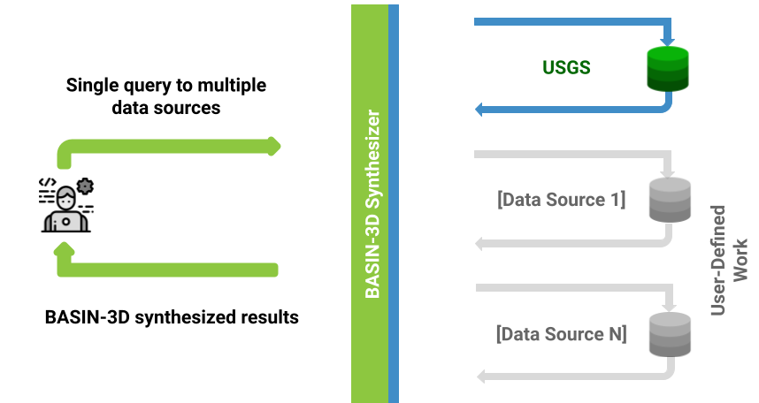

BASIN-3D Concepts
********************

A brief overview of BASIN-3D terms and concepts
-----------------------------------------------

Plugins (aka, data sources)
============================

BASIN-3D translates queries of BASIN-3D’s data model to queries of individual data sources whose plugins have been registered.

    A *plugin* is a software component that extends functionality. In this case, a plugin will add access to data sources desired for synthesis. A *data source* is where the data originates.

    A plugin to USGS Daily Water service is available with BASIN-3D. Future releases will provide additional plugins and custom plugins can be built.

BASIN-3D allows scientists to make a single query to multiple data sources.

BASIN-3D accesses data sources on-demand. Plugins map the data source query and return (meta)data to BASIN-3D’s data model (see Observations, Monitoring Features, Observed Properties below).

Observations (aka, data)
==========================

BASIN-3D is designed to support diverse types of data, which we call observations. Examples of observation types include: time series, images, gridded layers, results of lab analyses, qualitative descriptions. BASIN-3D currently supports time series observations.

**Features of Interest**
    Observations typically describe an aspect of something. Features of interest include organisms or physical entities.

**Monitoring Features**
    Features of interest are often physical entities more commonly referred to as locations or samples, which we collectively call *monitoring features*:

**Observed Properties**
    The aspect of something that the observation describes is called the *observed property*; these are variables.

*IMPORTANT: To query many observation types using BASIN-3D, monitoring features and observed properties must be specified.*

**Additional Metadata**
    Observations have many other metadata, including when it occurs in time. See XXX for additional metadata available for observations.

Monitoring Features (e.g., Locations and Samples)
====================================================

*Monitoring features* are what an observation is characterizing.

**Feature Types**
    Data often characterize physical entities. In Earth Science monitoring features can be categories of *feature types* such as basins, watersheds, and points.

    BASIN-3D is currently bundled with feature types for hydrological earth science data (See xxx to get a list of these feature types).  However, the design allows for the definition of other domain specific feature types.

**Parent Features**
    Monitoring features can be organized into hierarchies to enable queries by *parent features*:

**Additional Metadata**
    Monitoring features have metadata that include their geo-reference. See XXX for additional metadata available for monitoring features.

Observed Properties (e.g., Variables)
====================================================

An *observed property* is the aspect of a monitoring feature being characterized by the observation.

    Observed properties are commonly called variables. Examples include stream discharge, air temperature, aluminum concentration

    BASIN-3D uses a defined list of observed properties and their units to which data source variable names and units are mapped. By default, BASIN-3D uses a list of variables commonly used in hydrological-focused Earth Science.

