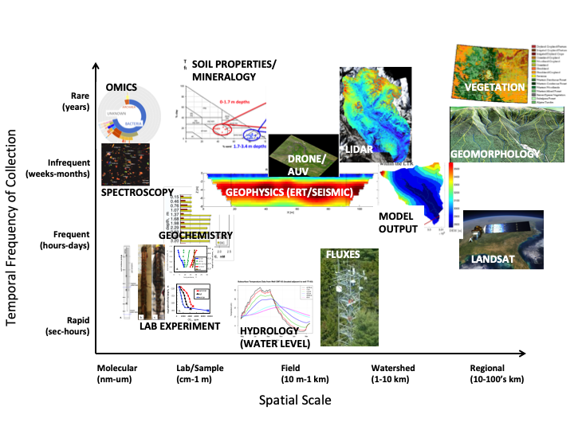
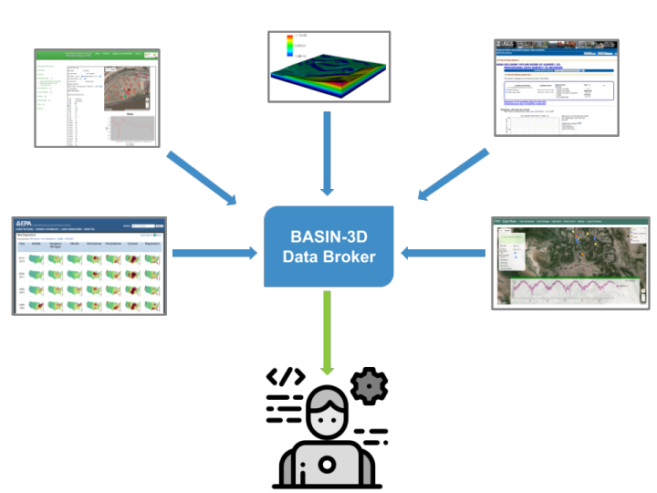

.. _basin3dintro:

What is BASIN-3D?
*****************
**Broker for Assimilation, Synthesis and Integration of eNvironmental Diverse, Distributed Datasets**

BASIN-3D is a software ecosystem that synthesizes diverse earth science data from a variety of remote data sources on-demand, without the need for storing data in a single database. It is designed to parse, translate, and synthesize diverse observations from well-curated repositories into standardized formats for scientific uses such as analysis and visualization. Thus, BASIN-3D enables users to always have access to the latest data from each of the sources and interact with the data as if they were integrated in local storage. More importantly, users can also integrate public data without establishing prior working relationships with each data source.

basin3d is the core BASIN-3D application that uses a generalized data synthesis model that applies across a variety of earth science observation types (hydrology, geochemistry, climate etc.). The synthesis models, basin3d’s abstract formats, are based on the Open Geospatial Consortium (OGC) and ISO “Observations and Measurements” (OGC 10-004r3 / ISO 19156: 2013) and OGC “Timeseries Profile of Observations and Measurement “(OGC 15-043r3) data standards.

The current version of basin3d can be used to integrate time-series earth science observations across a hierarchy of spatial locations. The use of the OGC/ISO framework makes basin3d extensible to other data types, and in the future we plan to add support for remote sensing and gridded (e.g. model output) data. basin3d is able to handle multi-scale data, through the use of the OGC/ISO framework that allows for specification of hierarchies of spatial features (e.g., points, plots, sites, watersheds, basin).  This allows users to retrieve data for a specific point location or river basin.

basin3d has available plugins that can connect to specific data sources of interest, and map the data source vocabularies to the basin3d synthesis models.

Readers can find out more about BASIN-3D and its application to the East River Watershed for the Watershed Function SFA at Hubbard et al. (2018), Hendrix et al. (2019), Varadharajan et al. in review (available upon request).

References
^^^^^^^^^^

- Hubbard, S. S., K. H. Williams, D. Agarwal, J. Banfield, H. Beller, N. Bouskill, E. Brodie, R. Carroll, B. Dafflon, D. Dwivedi, N. Falco, B. Faybishenko, R. Maxwell, P. Nico, C. Steefel, H. Steltzer, T. Tokunaga, P. A. Tran, H. Wainwright, and C. Varadharajan. 2018. The East River, Colorado, Watershed: A Mountainous Community Testbed for Improving Predictive Understanding of Multiscale Hydrological–Biogeochemical Dynamics. Vadose Zone J. 17:180061. http://dx.doi.org/10.2136/vzj2018.03.0061
- Hendrix,V.C., D.S. Christianson, S.S. Hubbard, D.A. Agarwal and C. Varadharajan, "BASIN-3D: Reducing the data processing burden for earth scientists", accepted to Gateways 2019.
- Varadharajan C., V. Hendrix, D. C. Christianson, S. S. Hubbard, and D. A. Agarwal, “BASIN-3D: A Brokering Framework to Integrate Diverse Environmental Data,” in review.